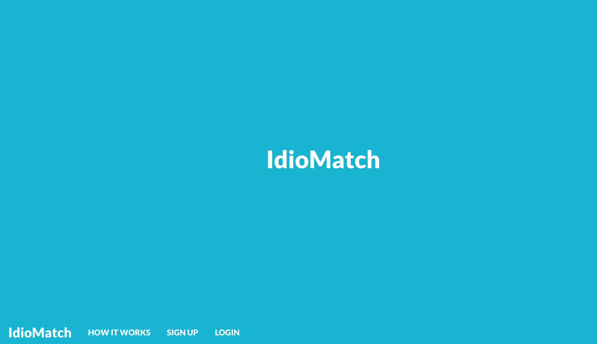
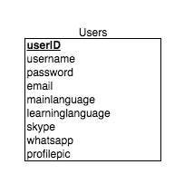

# IdioMatch





## Overview
**IdioMatch is a matchmaking service that lets you teach a language to another person, and in exchange, be taught a language by that same person!**


**Here is how it works in just 3 simple steps:**

1. Tell us what languages you are fluent in and what languages you are trying to learn.
 
2. Get connected with someone who is learning your language, but can also teach you theirs.

3. Start communicating via WhatsApp, Skype, or email address and begin learning a new language with a native speaker!

## Links
[Github Repo](https://github.com/Dashy10/idiomatch)

[Live Application](http://idiomatch.herokuapp.com/)


## User Stories

As a user, one should be able to do the following:

- I want to see a fullscreen, colorful landing page with a brief synopsis of the product.
- I also want to see a fixed navigation bar that shows me the name/logo, as well as links to an about page,see-how-it-works page, registration page and login page. 
- I want to see a footer representing the product. I want to see contact information on the footer so I can contact the creator and possibly contribute to the development of the prototype as well. 
- I want to test the product before signing up for an account by
inputing my name, main language, and learning language.
- On the see-how-it-works page, I want to see my new test profile appear with the # of matches I have made and all the users that I have matched with.
- For the prototype users, I want to see their main languages, language that they are trying to learn, whether or not they have matched with me and I also want to see phony contact information.  
- I want to see support for at least 6 languages.
- I want to see an about page that tells me more information about the application. I want to see language learning statistics on this page as well as basic statistics regarding the application. 

## Wireframes

## Pseudocode

**Filtration System:**

- Six language filters

- Select one main language from six languages

- Select one learning language from the same six languages

- Click a filter button that will make an axios.get call to the imd (idiomatch database)

##### Logic for filtering through selections

```
If selectedLanguage = mainLanguage.english 
					&& 
selectedLearningLanguage = learningLanguage.spanish


Display from users table the following data:

[Profile_pic;username;main_language;location;
learning_language; skype; email address; WhatsApp number] 

WHERE 
mainLanguage.language = mainLanguage.spanish 
						&&
learningLanguage.language = learningLanguage.english
```

##### Rendering the data on the front-end

```
For each matching_user; render

<div class='user-card'>
users.profile_pic </img>
<h4>users.username</h4>
<p> Main Language <span>users.mainLanguage</span></p>
<p>Learning Language <span>users.learningLanguage/span></p>
<p>Skype <span>users.skype</span></p>
<p>Email Address <span>users.email</span></p>
<p>Learning Language<span>users.WhatsApp</span></p>
</div>

```

## Project Timetable


## Database Structure



## Technologies

- HTML
- CSS
- JavaScript
- PostgreSQL
- Heroku
- Express
- EJS templating view
- Postman
- Postico
- jQuery
- Foundation
- IdioMatch API

##### Additional Features
- GoogleMaps API
- Animate.css
- Passport.js/Open Auth

## Code Example

## Future Improvements

## Contributing

This project was developed as part of the Web Development Immersive program at General Assembly in NYC, June 2017.

Instructors: Patrick Andre, Joe Keohan, Jon Zachary

TA's: Matt Kersner, Dominic Farquharson, Jonathan Ahrens & Jason Andrada.

## Author(s)

[Dashiell Lumas](https://github.com/Dashy10/) 


